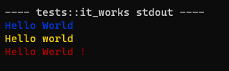

# Logger for Rust
###### ver 0.1.1

---

# Usage
```rust
#[test]
fn it_works() {
    info!("Hello World");
    warn!("Hello {}", "world");
    error!("{} {} {}", "Hello", "World", "!");
}
```

# Output
